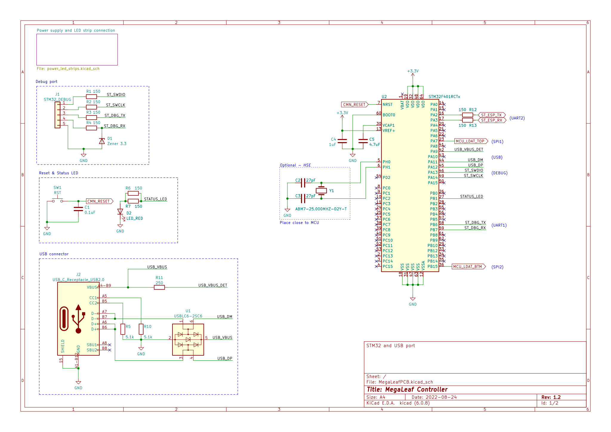
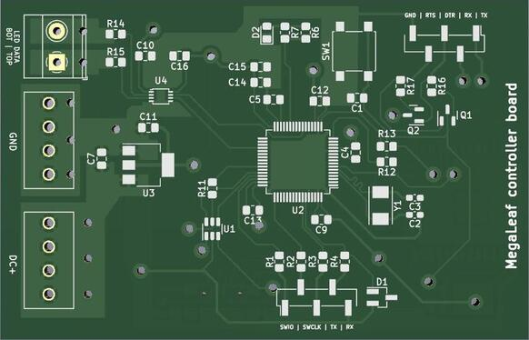
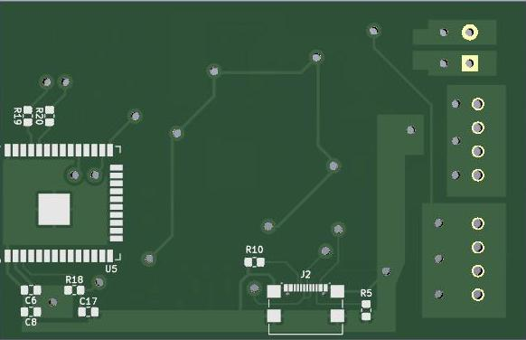

# MegaLeaf schematic and PCB

Hardware base of MegaLeaf project is a custom-designed and home-made PCB board, equipped with both STM32F4 and Esperif ESP32-C3 microcontrollers.

The main goal of this board was to support communication between LEDs strip and STM32F4 MCU via voltage level shifter. Furthermore, it connects MCU with both Esperif ESP32 Wifi module (for IoT cloud communication) and USB type C connector (used in old-school USB2.0-FS mode). Finally, there's a 3.3V linear stabilizer powered from the LEDs power supply and USB ESD protection.

## Schematic preview

**Note**: Full schematic as PDF document is available [here](renders/MegaLeafPCB.pdf).

## PCB views

The design of PCB has been stricly adapted for the process of making home-made DIY PCB board. That's why vias are huge (1.2mm hole diameter) and limited to the very minimum (as every single one of them has to be drilled manually), copper tracks are extra spaced when possible to prevent problems during itching process and all components are far from each other to ease soldering on board without soldermask.

But since, there aren't any very high frequency signals (48MHz from USB2.0 is the fastest line here), all of the above flaws should not affect final performance and stability of this board.

| Front | Back |
| -- | -- |
|  |  |

## Sources

Links to some useful resources used during board development:

1. Getting started with STM32F4 hardware development - [AN4488](https://www.st.com/resource/en/application_note/dm00115714-getting-started-with-stm32f4xxxx-mcu-hardware-development-stmicroelectronics.pdf)

2. Esperif hardware reference - [docs.esperif.com](https://docs.espressif.com/projects/esp-idf/en/latest/esp32c3/hw-reference/index.html)
