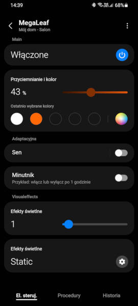

# Esperif-based WiFi controller

Main MCU responsible for controlling LEDs strip and communicating over USB connector is STM32. In order to support control of MegaLeaf over SmartThings cloud, extra Esperif based MCU has been added to the board. It's sole purpose is to mantain connection with ST cloud over WiFi, monitor for incomming requests and reroute them to STM32 controlling LEDs.



## Overview

Project uses generic ESP32C3 subboard, equipped with Xtensa ESP32 microcontroller. 

The communication between Esperif and STM32 is concluded over USART interface. Both microcontrollers shares information with each other - Esperif notifies STM32 about changes comming from SmartThings cloud and STM32 shares events triggered by PC software via USB interface.

Firmware for ESP32 coprocessor uses official Samsung's SmartThing library for intercating with IoT cloud.

## Building

Start by setting up ESP32 development suite as decribed on "[ESP32 Get Started page](https://docs.espressif.com/projects/esp-idf/en/latest/esp32/get-started/#manual-installation)". Next, create new SmartThings direct connected device as described [here](https://developer.smartthings.com/docs/devices/direct-connected/register-your-device) and download configuration files `device_info.json` + `onboarding_config.json` into `main/cfg/` directory.

Build this project with the following command:

```sh
idf.py build
```

Finally, flash compiled image using command:

```sh
idf.py flash
```

For details regarding flashing MCU refer to the [official ESP32 manual](https://docs.espressif.com/projects/esp-idf/en/latest/esp32/api-guides/tools/idf-py.html#flash-the-project-flash).
